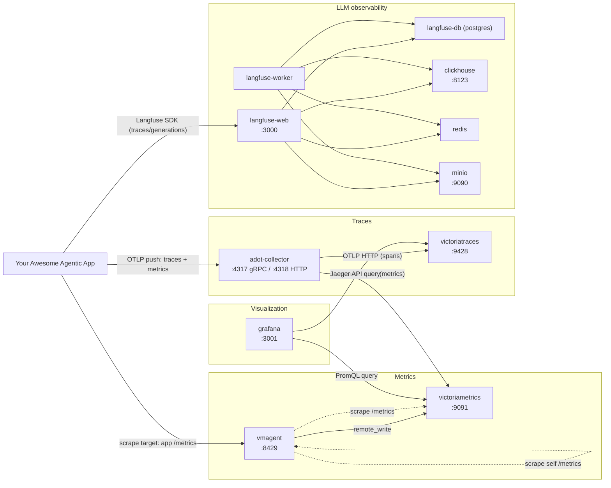

# Local Observability Cluster

A Docker Compose stack that stands up a full observability backend on your Mac — metrics, traces, and LLM/agent tracing — so you can point an app you're building straight at real collectors and dashboards instead of mocking them out or shipping to a shared environment just to see if instrumentation works.

It's meant to sit next to whatever app you're developing: point your app's OTLP exporter, Prometheus client, or Langfuse SDK at the ports below, and you get end-to-end observability — collection, storage, and querying/visualization — running locally. Useful for:

- Verifying instrumentation (traces, metrics, LLM spans) actually reaches a collector before wiring it up against staging/prod infra.
- Iterating on dashboards, alerts, or trace/metric shape without waiting on a shared cluster.
- Debugging what your app emits — inspect raw spans/metrics in Grafana or Langfuse instead of guessing from application logs.
- Reproducing production-shaped pipelines (OTel collector → storage → Grafana) locally, with the same query APIs (PromQL, Jaeger API) your app or dashboards would use against the real thing.

Components: metrics (VictoriaMetrics + vmagent + Grafana), traces (VictoriaTraces via an OTel collector), and LLM observability (Langfuse v3).

## Stack overview

| Service | Image | Purpose | Local port |
|---|---|---|---|
| `adot-collector` | `amazon/aws-otel-collector` | OTLP receiver (gRPC/HTTP), fans out traces/metrics | `4317` (gRPC), `4318` (HTTP) |
| `victoriatraces` | `victoriametrics/victoria-traces` | Trace storage, Jaeger-compatible query API | `9428` |
| `victoriametrics` | `victoriametrics/victoria-metrics` | Metrics storage (Prometheus remote-write target) | `9091` |
| `vmagent` | `victoriametrics/vmagent` | Scrapes Prometheus metrics, remote-writes to VictoriaMetrics | `8429` |
| `grafana` | `grafana/grafana` | Dashboards, pre-provisioned with the VictoriaMetrics + VictoriaTraces datasources | `3001` |
| `langfuse-web` | `langfuse/langfuse:3` | Langfuse UI/API | `3000` |
| `langfuse-worker` | `langfuse/langfuse-worker:3` | Langfuse background worker | — |
| `langfuse-db` | `postgres:15` | Langfuse metadata store | — |
| `clickhouse` | `clickhouse/clickhouse-server` | Langfuse event/analytics store | `8123`, `9000` (localhost only) |
| `redis` | `redis:7` | Langfuse cache/queue | — |
| `minio` | `quay.io/minio/minio` | S3-compatible blob store for Langfuse media/events | `9090` (API), console via `mc`/SDK |

Everything runs on `platform: linux/arm64`, so this is set up for **Apple Silicon Macs**. On an Intel Mac, either remove the `platform:` lines or add `platform: linux/amd64` so Docker doesn't emulate.

## Architecture



- **Solid arrows** are data actually flowing (pushes, remote-writes, queries). **Dotted arrows** are vmagent's scrape targets (pull-based).
- Your app can feed metrics in two ways: expose a `/metrics` endpoint that vmagent scrapes, or push OTLP metrics to the collector, which remote-writes them into VictoriaMetrics — see [How your app plugs into each stack](#how-your-app-plugs-into-each-stack) below.
- Traces only have one path in: OTLP to the `adot-collector`, which forwards to VictoriaTraces.
- Grafana never receives data directly — it only queries VictoriaMetrics (PromQL) and VictoriaTraces (Jaeger API) on demand.
- Langfuse is a separate, self-contained pipeline: your app's Langfuse SDK talks to `langfuse-web`, which (along with `langfuse-worker`) persists to Postgres, ClickHouse, Redis, and MinIO.

## How your app plugs into each stack

### Metrics — vmagent + VictoriaMetrics + Grafana

Two ways for metrics to get in, depending on whether your app pushes or exposes:

- **App exposes a `/metrics` endpoint (Prometheus-style)**: add a job to `vmagent-config.yml` pointing at your app's host:port, then restart vmagent (`docker compose restart vmagent`). vmagent scrapes it every 15s and remote-writes into VictoriaMetrics — this is the same pattern already used for `vmagent` and `victoriametrics` self-scraping.
- **App pushes metrics via OTLP**: send OTLP metrics to the `adot-collector` (`localhost:4317` gRPC / `localhost:4318` HTTP). The collector's `prometheusremotewrite` exporter forwards them to VictoriaMetrics (`otel-collector-config.yaml`).

Either way, query the result with PromQL against `http://localhost:9091` or build dashboards in Grafana (`http://localhost:3001`), which already has VictoriaMetrics wired up as the default datasource.

### Traces — OTel collector + VictoriaTraces

Point your app's OTel SDK/exporter at the collector:

- gRPC: `localhost:4317`
- HTTP: `localhost:4318`

The collector (`otel-collector-config.yaml`) batches spans and forwards them to VictoriaTraces via OTLP HTTP. From there you can:

- Query the Jaeger-compatible API directly: `curl http://localhost:9428/select/jaeger/api/services`
- Browse/search traces in Grafana via the pre-provisioned VictoriaTraces (Jaeger) datasource.

This is useful for checking that request spans, span attributes, and service names look right before pointing the same exporter at a shared/prod collector.

### LLM/agent observability — Langfuse

If your app calls an LLM (directly or through a framework with Langfuse integration — e.g. the Langfuse Python/JS SDK, or OpenAI/LangChain wrappers), point it at this local Langfuse instance instead of Langfuse Cloud:

- Host: `http://localhost:3000`
- Create a project in the UI, generate a public/secret API keypair, and configure your app's Langfuse client with those keys and the local host URL.

Langfuse captures LLM calls as traces/generations (prompt, completion, latency, token usage, cost), storing them in ClickHouse with Postgres for metadata, Redis for queueing, and MinIO for any uploaded media/event blobs. This lets you inspect full prompt/response traces for an agent or LLM feature locally — useful for debugging prompt behavior or evaluating changes before they hit a shared Langfuse project.

## Prerequisites

- **Docker Desktop for Mac** (includes Docker Compose v2). Install from [docker.com](https://www.docker.com/products/docker-desktop/) or via Homebrew:
  ```bash
  brew install --cask docker
  ```
  Then launch Docker Desktop once so the daemon is running.
- Enough free disk space/memory allocated to Docker — this stack runs 11 containers, including ClickHouse and Postgres. In Docker Desktop, bump memory to at least 6–8 GB under *Settings → Resources* if things start OOM-ing.
- `curl` and (optionally) `python3` for the verification steps below (both ship with macOS).

No `.env` file is required — all credentials for local dev (Postgres, Redis, MinIO, Langfuse encryption key, etc.) are hardcoded as local-only defaults directly in `docker-compose.yml`. **Do not reuse these for anything beyond local development.**

## Setup

1. Clone the repo and `cd` into it.
2. Start the full stack:
   ```bash
   docker compose up -d
   ```
   First run will pull several images (Langfuse, ClickHouse, MinIO, VictoriaMetrics, Grafana, etc.) — this can take a few minutes.
3. Watch startup, especially the Langfuse dependency chain (`langfuse-db`, `clickhouse`, `redis`, `minio` → `minio-init` → `langfuse-web`/`langfuse-worker`):
   ```bash
   docker compose ps
   docker compose logs -f langfuse-web
   ```
4. Once containers report healthy/running, verify each piece as below.

To stop everything (keeping data volumes):
```bash
docker compose down
```

To stop and wipe all persisted data (Postgres, ClickHouse, MinIO, VictoriaMetrics, Grafana, etc.):
```bash
docker compose down -v
```

## Verifying the stack

### Grafana

Open [http://localhost:3001](http://localhost:3001) — log in with `admin` / `admin` (set via `GF_SECURITY_ADMIN_PASSWORD`). Two datasources are pre-provisioned (see `grafana/provisioning/datasources/datasources.yaml`):
- **VictoriaMetrics** (Prometheus-compatible, default datasource)
- **VictoriaTraces** (Jaeger-compatible)

### Metrics pipeline (vmagent → VictoriaMetrics)

vmagent scrapes itself and VictoriaMetrics every 15s (see `vmagent-config.yml`) and remote-writes into VictoriaMetrics.

```bash
curl -s http://localhost:8429/metrics | grep '^vm_app_version'
curl -s 'http://localhost:9091/api/v1/query?query=vm_rows_added_to_storage_total{job="vmagent"}' | python3 -m json.tool
```

You can also check scrape target health at [http://localhost:8429/targets](http://localhost:8429/targets).

> `vmagent-config.yml` also lists remote scrape jobs (`os-metrics-scraper`, `metrics-reporter`, `node-exporter`, `kube-state-metrics`, `envoy-scraper`, `envoy-reporter`, `istiod`) pointing at `*.eks.iiaxsisii.net` targets. Those are only reachable if you're on the right VPN/network — they aren't required for local-only use and will just show as scrape failures otherwise.

### Traces pipeline (OTel collector → VictoriaTraces)

Send an OTLP trace to the collector on `localhost:4317` (gRPC) or `localhost:4318` (HTTP) — see `otel-collector-config.yaml` for the receiver/exporter config. The collector forwards traces to VictoriaTraces and metrics to VictoriaMetrics, logging both at `debug` verbosity (`docker compose logs -f adot-collector`).

Query VictoriaTraces directly:
```bash
curl -s http://localhost:9428/select/jaeger/api/services
```

### Langfuse

Open [http://localhost:3000](http://localhost:3000) to reach the Langfuse UI and create an account/project (this is a fresh local instance — there's no seeded user).

## File reference

- `docker-compose.yml` — the entire stack definition.
- `otel-collector-config.yaml` — OTel collector receivers/processors/exporters (OTLP in → VictoriaTraces + VictoriaMetrics out).
- `vmagent-config.yml` — Prometheus-style scrape config used by `vmagent`.
- `grafana/provisioning/datasources/datasources.yaml` — Grafana datasource provisioning (VictoriaMetrics + VictoriaTraces).
- `docs/superpowers/` — design/plan notes for how the `vmagent` service was added; useful background, not required reading for setup.

## Troubleshooting

- **Langfuse won't come up**: check `docker compose logs langfuse-web` — it waits on `langfuse-db`, `clickhouse`, `redis`, and `minio` to report healthy, and on `minio-init` to finish creating the `langfuse` bucket. If `minio-init` fails, check `docker compose logs minio-init`.
- **Port already in use**: another local process may be bound to one of `3000`, `3001`, `4317`, `4318`, `8123`, `8429`, `9000`, `9090`, `9091`, `9428`. Stop that process or edit the port mapping in `docker-compose.yml`.
- **Slow/emulated containers on Apple Silicon**: images are pinned to `platform: linux/arm64`, so they should run natively. If you see QEMU emulation warnings, confirm Docker Desktop itself is running natively (not under Rosetta).
- **Reset a single service's data**: `docker compose down <service>` then remove its named volume, e.g. `docker volume rm local-observability-cluster_clickhouse-data` (check the actual volume name with `docker volume ls`).
